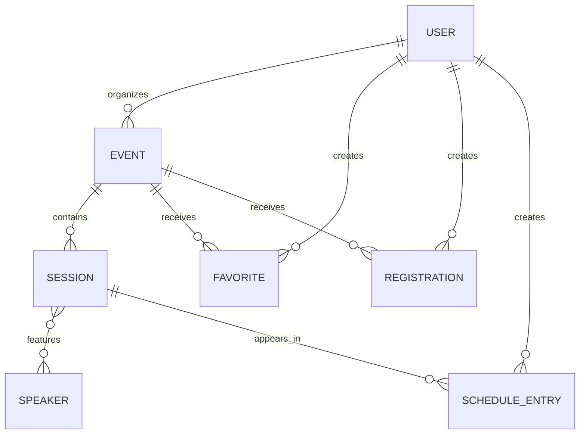

# TechEventHub - Modelo de Dominio

## Visao Geral

O modelo inicial separa descoberta, participacao e gestao. Ele e suficiente para o
MVP e podera ser refinado conforme os formularios e casos de uso forem detalhados.



## User

Representa uma conta simulada.

```ts
type UserRole = 'participant' | 'organizer' | 'administrator'

interface User {
  id: string
  name: string
  email: string
  role: UserRole
  avatarUrl: string | null
}
```

Regras:

- Todo usuario autenticado possui ao menos permissoes de participante.
- Organizador pode administrar apenas eventos cujo `organizerId` seja o seu.
- Administrador pode administrar todos os eventos.

## Event

E a entidade principal do produto e o agregado que contem suas sessoes.

```ts
type EventFormat = 'online' | 'in-person' | 'hybrid'
type EventStatus = 'draft' | 'published' | 'cancelled'

interface Event {
  id: string
  organizerId: string
  slug: string
  title: string
  summary: string
  description: string
  categoryId: string
  format: EventFormat
  status: EventStatus
  startsAt: string
  endsAt: string
  capacity: number
  location: EventLocation | null
  coverImageUrl: string | null
  sessions: Session[]
  createdAt: string
  updatedAt: string
}
```

Regras:

- Somente eventos publicados aparecem no catalogo publico.
- `endsAt` deve ser posterior a `startsAt`.
- `capacity` deve ser um inteiro positivo.
- O slug deve ser unico.
- Sessoes devem ocorrer dentro do intervalo do evento.
- Somente rascunhos podem ser excluidos definitivamente.
- Um evento publicado pode ser cancelado, mas permanece consultavel.
- Um evento encerrado nao aceita novas inscricoes.

### Invariantes de Publicacao

Um rascunho pode ser persistido incompleto. Para mudar de `draft` para
`published`, o evento deve possuir:

- titulo, resumo e descricao;
- categoria e imagem de capa;
- formato e localizacao compativel;
- inicio, fim e capacidade validos;
- ao menos uma sessao;
- titulo, horario valido e ao menos um palestrante em cada sessao;
- todas as sessoes dentro do periodo do evento.

Essas regras pertencem ao comando de publicacao. O schema de rascunho sera mais
permissivo que o schema de publicacao.

### Estado Persistido e Estado Derivado

O campo `status` armazena apenas transicoes explicitas do negocio:

```ts
type EventStatus = 'draft' | 'published' | 'cancelled'
```

Condicoes temporais e permissoes sao derivadas:

```ts
interface EventState {
  isPast: boolean
  isUpcoming: boolean
  canRegister: boolean
  canDelete: boolean
  canCancel: boolean
}
```

Essas propriedades nao serao persistidas. Elas serao calculadas a partir do evento,
do horario atual, da quantidade de inscricoes e do perfil autenticado.

## EventLocation

A localizacao varia de acordo com o formato. O contrato final sera uma uniao
discriminada validada com Zod.

```ts
type EventLocation =
  | { type: 'online'; platform: string; accessUrl: string | null }
  | {
      type: 'physical'
      venue: string
      address: string
      city: string
      state: string
    }
  | {
      type: 'hybrid'
      platform: string
      accessUrl: string | null
      venue: string
      address: string
      city: string
      state: string
    }
```

## Session

Representa uma atividade individual dentro de um evento.

```ts
interface Session {
  id: string
  title: string
  description: string
  startsAt: string
  endsAt: string
  room: string | null
  speakerIds: string[]
}
```

Regras:

- O fim deve ser posterior ao inicio.
- A sessao deve ocorrer durante o evento.
- Uma sessao pode possuir mais de um palestrante.

## Speaker

```ts
interface Speaker {
  id: string
  createdByUserId: string
  status: 'active' | 'archived'
  name: string
  headline: string
  biography: string
  company: string | null
  avatarUrl: string | null
  socialLinks: {
    website?: string
    github?: string
    linkedin?: string
  }
}
```

Regras:

- Um palestrante pode participar de sessoes em eventos diferentes.
- Qualquer organizador pode consultar e selecionar palestrantes ativos.
- Somente o criador ou um administrador pode editar ou arquivar o cadastro.
- Um palestrante referenciado por uma sessao nao pode ser excluido definitivamente.
- Palestrantes arquivados permanecem nas sessoes existentes, mas nao aparecem em
  novas selecoes.

## Favorite

```ts
interface Favorite {
  userId: string
  eventId: string
  createdAt: string
}
```

Representa interesse. O par `userId/eventId` deve ser unico e sua criacao exige
autenticacao.

## Registration

```ts
type RegistrationStatus = 'confirmed' | 'cancelled'

interface Registration {
  id: string
  userId: string
  eventId: string
  status: RegistrationStatus
  createdAt: string
  cancelledAt: string | null
}
```

Uma inscricao ativa ocupa uma vaga. So pode existir uma inscricao ativa por
participante e evento.

## ScheduleEntry

```ts
interface ScheduleEntry {
  userId: string
  sessionId: string
  createdAt: string
}
```

Regras:

- Exige inscricao ativa no evento ao qual a sessao pertence.
- O par `userId/sessionId` deve ser unico.
- Conflitos de horario devem ser informados antes da inclusao.
- Cancelar a inscricao remove as entradas relacionadas ao evento.

## Category

```ts
interface Category {
  id: string
  slug: string
  name: string
}
```

As categorias serao dados de referencia fornecidos pela API fake. Nao fazem parte
do CRUD administrativo inicial.
